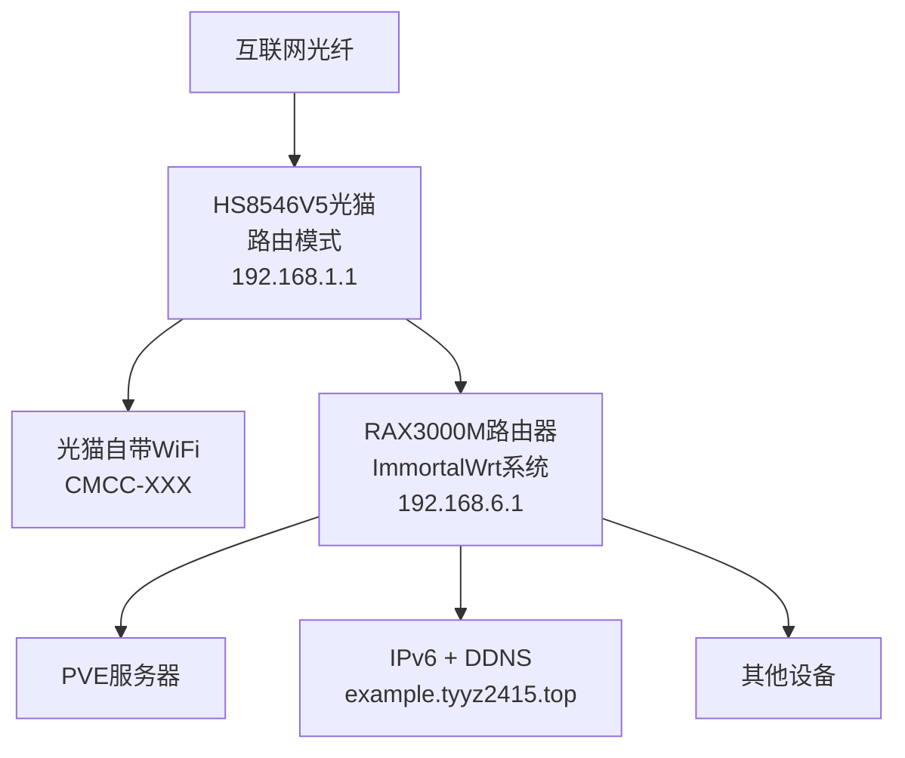

**这里全部都是我的硬件配置，可以提供参考**

### CPU 内存 主板

如果只是做个人 NAS，推荐 E5 等低功耗的服务器级 U
我使用的是一颗 AMD R7 1700X，8 核心 16 线程，TDP 为 95W  
如果你需要 windows 虚拟机，那么至少需要这台机器在原生运行 Windows 时可以保持流畅，另外建议使用带有核显的 CPU，否则在直通显卡以后你的宿主机控制台会被 windows 占用

内存我使用的是金百达银爵 8G*2 DDR4 3200 频率
由于 TrueNas 的推荐配置为 16G 内存（实测 8G 并没有问题），所以建议的总的最低内存为 16G

搭建个人服务器的话，一般推荐 sata 口多的 itx 主板，服务器级主板最好  
我这里用微星 m-atx 主板 B350 mortar 凑合，只有 4 个sata口，后续可以考虑sata扩展卡或HBA卡

### 独显 可选

如果你不需要跑 windows，那么可以不配置独显，如上文所述，系统搭建前期建议尽量保留核显给宿主机作为排查问题的窗口，所以如果你有另外的显示需求或者硬件解码需求，还是推荐配备一个独显  
独显型号需要按照你的使用方式自行斟酌，我？亮机卡GT710 2G

### 硬盘

系统盘：建议使用固态硬盘以保证系统流畅,我现在先使用~~铭瑄 120G sata 固态~~Inter s4500 480G

数据盘：由于文件系统需要长期运行，并会经常伴随读写，所以需要避开叠瓦盘（SMR）。另外由于至少需要组成 RAID1 阵列来保证数据安全，所以至少需要两块数据盘  
推荐 NAS 专用盘、监控盘或者企业盘

### 电源 机箱 散热

电源这个我随便，越稳越好，电压一定要稳  
因为机箱比较小而且我用塔式散热器，我用的小1U 全模组电源

散热能压得住 CPU 温度就行，我是利民 AX90 SE 塔式散热器，再接几个机箱风扇

机箱就八仙过海各显神通了，没什么要求，我使用星之海的射手座，要是有机架就好了，可惜我是学生党

### 旁路由 可选

我使用了一台CMCC RAX3000M~~蒲公英 R300A~~ 来配置服务器的网络

它的功能：

- 为服务器提供网络
- 利用软件进行异地组网
- ssh 跳板机

你可以选择其他设备比如树莓派，或者智能路由器充当这个角色，但强烈建议保持这个网络连接中枢的独立性

### UPS 可选

建议使用 UPS 保证机器的安全。ZFS 在突发断电时有可能出现元数据损坏，这会导致整个阵列既无法使用也**无法恢复**  
你说得对，所以有好心人送我一个吗

### U 盘

你需要一个 U 盘来烧录 pve 的磁盘镜像，作为物理机安装系统的启动盘

### 局域网

保持网络稳定

首先是内网 IP 地址的稳定，通常情况下路由器会根据设备的 MAC 地址给局域网中的网络设备分配一个稳定的内网 IP，但并不尽然，一旦局域网的网关将服务器中的设备 IP 刷新了，那么会导致你无法访问自己的服务，也无法正常访问存储池

如果你的本地网络出现了这种情况，则需要修改路由器的设置来使局域网 IP 稳定下来

### 公网 IP

取得一个公网 IP 对于提升系统易用性的好处是很大的。最直接的好处就是你可以通过 DDNS 工具来让自己在公网上直接访问到服务，否则你就需要借助各种内网穿透手段达到相同的目的

如果你无法获取公网 IPv4 地址也不用担心，随着 IPv6 的发展，现在的主流家用宽带都已经能够分配 IPv6 地址，而 IPv6 地址天生就是公网地址。你可以打电话给宽带的运营人员，把家里的光猫设置为桥接模式，并在自己的路由器中打开 ipv6 功能。通过重启路由器或者等待一段时间（几小时或几天），等到整个局域网中的设备都使用了桥接模式下的新 IPv6 地址。此时就可以去专门 IPv6 测试网站上测试一下你的 IPv6 连通性如何了，如果测试通过了，你大概率就可以顺利使用 parsec、ddns 等依赖公网 ip 的工具了

### 场地

系统运行时不可避免的产生噪音，主要是风扇声以及机械硬盘写入的声音。即使你使用无风扇的低功耗平台来搭建系统，机械硬盘的声音也是不容小觑的，~~所以强烈不建议将机器放在卧室等休息的地方~~我就放在卧室

目前我的网络结构，以后可能会考虑光猫改桥接，RAX3000M当主路由  
然后用单路复用，重利用光猫的Wifi做AP

